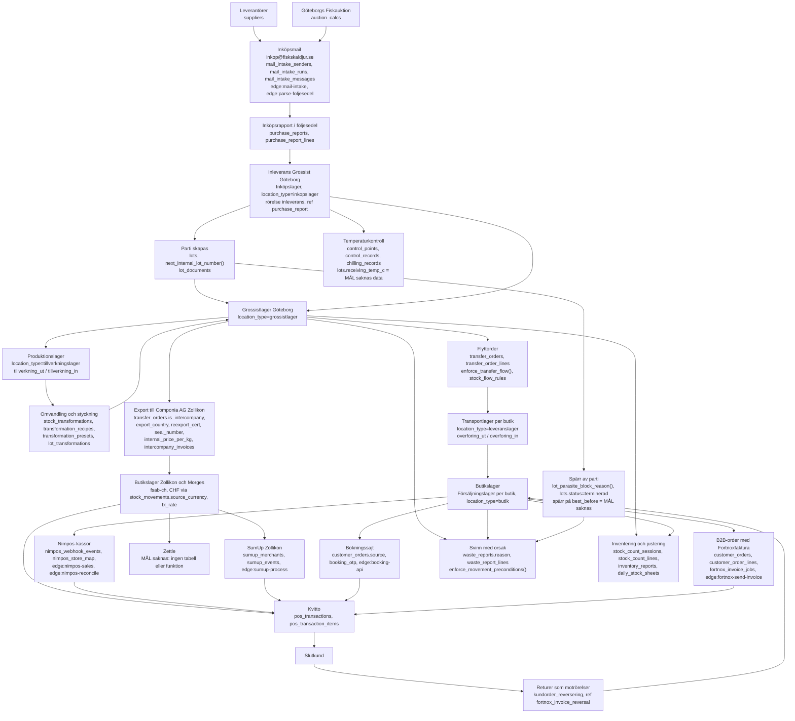
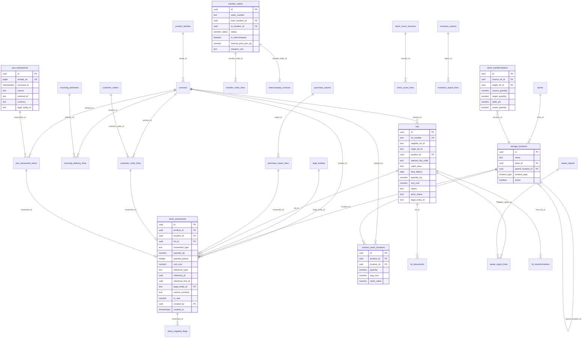
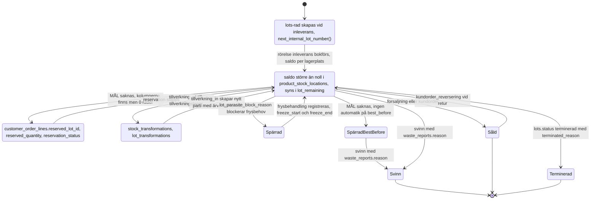

# Lagerblueprint — inköp till slutkund

Dokumentet är byggt genom inspektion av den faktiska databasen 2026-09-14
(`information_schema.columns`, `pg_constraint`, `pg_proc`, `pg_trigger`, `cron.job`,
samt räkningar i tabellerna). Varje påstående pekar ut tabell, kolumn, trigger,
funktion eller edge function med namn. Det som inte finns i databasen är märkt
**MÅL (saknas)** och är inte byggt.

Läsanvisning: `tabell.kolumn` = verifierad kolumn. `funktion()` = verifierad
databasfunktion. `edge:namn` = verifierad edge function i `supabase/functions/`.

---

## 1. Flödesdiagram — hela kedjan

---

## 2. Nodtabell — lagerplatser i databasen

`storage_locations` har 93 rader, varav 21 aktiva (`active = true`). Bolag härleds
via `storage_locations.store_id → stores.legal_entity_id` och
`company_of_location()`. `location_type` är enum `location_type` med värdena
`inkopslager, grossistlager, tillverkningslager, leveranslager, butik`.

### Aktiva noder

| Bolag | Enhet | Lagerplats | location_type | In | Ut |
|---|---|---|---|---|---|
| fsab-se | Grossist Göteborg | Inköpslager | inkopslager | inleverans, justering, inventering | overforing_ut, svinn, justering |
| fsab-se | Grossist Göteborg | Grossistlager | grossistlager | overforing_in, tillverkning_in, justering, inventering | overforing_ut, tillverkning_ut, kundorder, forsaljning, svinn, justering |
| fsab-se | Grossist Göteborg | Produktionslager | tillverkningslager | tillverkning_in, overforing_in | tillverkning_ut, overforing_ut, svinn |
| fsab-se | Amhult, Eriksberg, Marstrand, Särö Centrum, Torslanda Torg | Transportlager *butik* | leveranslager | overforing_in | overforing_ut, svinn |
| fsab-se | Amhult, Eriksberg, Marstrand, Särö Centrum, Torslanda Torg | Försäljningslager | butik | overforing_in, inventering, justering, kundorder_reversering | forsaljning, kundorder, svinn, overforing_ut, justering |
| de-no1 | Ålstens Fisk, Fiskskaldjur Kungsholmen | Transportlager *butik* | leveranslager | overforing_in | overforing_ut, svinn |
| de-no1 | Ålstens Fisk, Fiskskaldjur Kungsholmen | Försäljningslager | butik | overforing_in, inventering, justering, kundorder_reversering | forsaljning, kundorder, svinn, justering |
| fsab-ch | Fiskskaldjur Zollikon, Morges Market | Transportlager *butik* | leveranslager | overforing_in | overforing_ut, svinn |
| fsab-ch | Fiskskaldjur Zollikon, Morges Market | Försäljningslager | butik | overforing_in, inventering, justering | forsaljning, kundorder, svinn |

Tillåtna flyttar mellan nodtyper styrs av `stock_flow_rules` (7 rader) och
kontrolleras av triggern `trg_enforce_transfer_flow` → `enforce_transfer_flow()`:

| Från | Till | Krävt underlag | Kräver orsak |
|---|---|---|---|
| inkopslager | grossistlager | purchase_report | nej |
| grossistlager | tillverkningslager | production_order | nej |
| tillverkningslager | grossistlager | production_order | nej |
| grossistlager | leveranslager | shop_order | nej |
| leveranslager | butik | shop_order | nej |
| butik | leveranslager | return_order | ja |
| leveranslager | grossistlager | return_order | ja |

### Inaktiva noder som finns kvar i registret

72 rader har `active = false`, bland annat per butik: `Inköpslager <butik>`,
`Tillverkningslager <butik>`, `Kyllager`, `Fryslager`, `Frysrum`, `Kylrum 1`,
`Raw Lager`, `Grossist Flytande`, `Pre-Stockholm`, `Pre-Torget`, `Pre-Zollikon`,
samt två bolagslösa rader `Pre-Produktion` och `Transportlager` (`store_id`
är null). `enforce_movement_preconditions()` blockerar alla rörelser på inaktiva
platser, och `enforce_transfer_flow()` blockerar dem i flyttorder.

Underlager stöds tekniskt via `storage_locations.parent_location_id` med triggern
`trg_enforce_location_hierarchy` → `enforce_location_hierarchy()`. Endast 4 rader
använder det idag, samtliga inaktiva.

---

## 3. Värdetabell per pil

`stock_movements` (18 kolumner) är den rad som skapas i varje steg. Tillåtna
`movement_type` enligt `stock_movements_movement_type_check`: `inleverans,
tillverkning_in, tillverkning_ut, overforing_in, overforing_ut, forsaljning,
kundorder, kundorder_reversering, svinn, justering, inventering`.
`stock_movements_quantity_kg_check` förbjuder noll.

### Fältstatus i partiet (`lots`, 65 kolumner, 332 rader)

| Värde | Kolumn | Status | Fyllnadsgrad |
|---|---|---|---|
| Parti-ID | `lots.id`, `lots.lot_number` (unik) | finns | 332/332 |
| Leverantörens partinummer | `lots.supplier_lot_id` | finns | 183/332 |
| Ursprungspartiets ID vid delning | `lots.origin_lot_id` (text) + `lot_transformations.from_lot_id/to_lot_id` | finns | 4/332 i `origin_lot_id`, 0 rader i `lot_transformations` |
| Produkt och SKU | `lots.product_id → products.sku, products.name` | finns | 332/332 |
| Kvantitet | `lots.quantity_kg`, rörelsen `stock_movements.quantity_kg` (kg) | finns | 332/332 |
| Antal styck | `stock_movements.quantity_pieces`, `products.weight_per_piece`, `products.nominal_weight_kg`, `products.catch_weight` | finns | 1 rörelse av 2 124 |
| Bäst före | `lots.best_before` | finns | 168/332 |
| Temperatur vid inleverans | `lots.receiving_temp_c`, `lots.receiving_temp_deviation_reason` | kolumn finns, **MÅL (saknas)** i praktiken | 0/332 |
| Kostpris | `lots.unit_cost`, `stock_movements.unit_cost`, `product_stock_locations.avg_cost` | finns | 307/332 |
| Prisstatus, slutpris | `lots.price_status` (332 = `preliminar`), `finalize_lot_price()`, `lots.invoice_number`, `lots.invoice_date` | finns | 0 partier slutprissatta |
| Art FAO alpha-3 | `lots.species_fao_code`, `products.fao_code` | finns | 199/332 |
| Vetenskapligt namn | `lots.latin_name` | finns | 322/332 |
| Fångstområde | `lots.catch_area` | finns | 266/332 |
| Redskap | `lots.fishing_gear`, `lots.fishing_gear_code` | finns | 289/332 |
| Produktionsmetod | `lots.production_method` | finns | 332/332 |
| Fartyg | `lots.vessel_name`, `vessel_reg`, `vessel_nation`, `lots.fishing_trip_id` | finns | 99/332 |
| Odling / musselvatten | `lots.production_area_classification`, `harvest_date`, `purification_center`, `bivalve_doc_number` | finns | musselfälten används av `set_lot_bivalve_flag()` |
| Fångstdatum | `lots.catch_date_from`, `lots.catch_date_to` | finns | 193/332 |
| Tidigare fryst | `lots.is_thawed`, `freeze_start`, `freeze_end`, `freeze_temp` | finns | 332/332 (bool) |
| Fångstintygsnummer vid import | `lots.incoming_catch_cert`, `lots.statistical_doc`, `transfer_orders.catch_certificate_ref`, `reexport_cert` | kolumn finns, **MÅL (saknas)** i praktiken | 0/332 |
| Avsändare/mottagare | `transfer_orders.from_location_id/to_location_id`, `picked_by`, `approved_out_by`, `approved_in_by` | finns | 5 flyttorder totalt |
| Bolag | `stock_movements.legal_entity_id` sätts av `set_company_from_location()` | finns | alla rörelser |
| Valuta | `stock_movements.source_currency`, `fx_rate`, `unit_cost_source` | finns | används av inköp och intercompany |

### Pil för pil

| Pil | Rad i stock_movements | movement_type | reference_type | Värden som följer med |
|---|---|---|---|---|
| Inköpsmail → inköpsrapport | ingen | – | – | `mail_intake_messages` (166 rader) → `purchase_reports.file_hash, document_number, supplier_id, document_date, total_ex_vat, source_currency, fx_rate`. Automatisk tolkning av partifält är **MÅL (saknas)**; `edge:parse-foljesedel` läser dokument, men fälten fastställs manuellt |
| Inleverans → Inköpslager | 1 rad per rad i följesedeln | `inleverans` | `purchase_report` (237 rörelser) | `product_id, location_id, lot_id, quantity_kg, unit_cost, unit_cost_source, source_currency, fx_rate, note` samt hela partiet i `lots` |
| Inköpslager → Grossistlager | 2 rader | `overforing_ut` + `overforing_in` | `transfer_order` (94 rörelser) | samma `lot_id` och `unit_cost` följer med, avsändare/mottagare i `transfer_orders`, avvikelser i `transfer_order_lines.pick_deviation_reason/ship_deviation_reason/receive_deviation_reason` |
| Grossistlager → Produktion | 1 rad ut, 1 rad in | `tillverkning_ut` (4) / `tillverkning_in` (5) | `production_order`, `production_report` | råvarupartiet lämnar, `stock_transformations.source_lot_id/target_lot_id`, `yield_pct`, `waste_quantity`, `waste_reason`, `performed_by` |
| Omvandling rå → kokt/filé | rader enligt ovan | `tillverkning_ut` + `tillverkning_in` | `production_order` | nytt parti skapas via `next_internal_lot_number()`; kostpris räknas om med `transformation_recipes.yield_pct` och `surcharge_per_kg`. Ärvd spårbarhet skrivs som `lot_transformations.from_lot_id → to_lot_id` — tabellen har **0 rader**, och `stock_transformations` har **0 rader**, så ärvningen är byggd men obeprövad i drift |
| Grossist → Transportlager → Butik | 2 rader per överlämning | `overforing_ut` + `overforing_in` | `transfer_order` | mottagarbekräftelse = `transfer_orders.status` (enum `transfer_status`: `skapad, plocklista_utskriven, godkand_utleverans, under_transport, delvis_levererad, godkand_inleverans, avvisad`) och `approved_in_by/approved_in_at`; `enforce_transfer_flow()` kräver underlag och stoppar oredovisade avvikelser |
| Export → Componia AG Zollikon | 2 rader | `overforing_ut` + `overforing_in` | `transfer_order` | `transfer_orders.is_intercompany` sätts av `enforce_intercompany_transfer()`, som kräver `internal_price_per_kg`; `export_country, reexport_cert, catch_certificate_ref, catch_cert_validated, seal_number`; faktura via `generate_intercompany_invoice()` → `intercompany_invoices`. CHF hanteras med `stock_movements.source_currency + fx_rate`. Förtullning i Basel har inget eget fält utöver dessa — tullhandling som dokumenttyp är **MÅL (saknas)** |
| Butik → Nimpos-kassa | 1 rad per kvittorad | `forsaljning` | `pos_transaction_item` | `pos_transactions` (128 rader, varav 126 `sumup`, 2 `internal`) med `receipt_no, occurred_at, total_ore, vat_breakdown, currency, legal_entity_id`; `pos_transaction_items.movement_id, lot_id, quantity, unit, unit_price_ore`. Skrivs av `edge:nimpos-sales` via `supabase/functions/_shared/nimpos.ts` |
| Zollikon → SumUp | 1 rad per kvittorad | `forsaljning` | `pos_transaction_item` | samma fält; `edge:sumup-process`, `sumup_events`, `sumup_product_map`, avstämning i `sumup_reconciliations` |
| Zollikon → Zettle | – | – | – | **MÅL (saknas)**: ingen tabell, funktion eller edge function för Zettle |
| Bokningssajt → order | 1 rad vid packning | `kundorder` (238) | `customer_order_line` (244 rörelser) | `customer_orders.source, wanted_date, currency, fx_rate_to_sek`, `customer_order_lines.quantity_packed, price_per_unit, movement_id`; partiet härleds med `pick_lot_fefo()` |
| B2B-order → Fortnoxfaktura | 1 rad per packad rad | `kundorder` | `customer_order_line`, samt `fortnox_invoice` (4 rörelser) | `fortnox_invoice_jobs`, `fortnox_build_invoice_input()`, `fortnox_on_invoice_created()`; idempotens via unikt index `uq_stock_movements_fortnox_line` på `reference_line_id` |
| Slutkund → retur | 1 motrörelse | `kundorder_reversering` (4) | `fortnox_invoice_reversal` (4) | samma `product_id, location_id, lot_id`, positiv `quantity_kg`; `fortnox_on_invoice_cancelled()` |
| Sidoflöde svinn | 1 rad | `svinn` (18) | `waste_report` (18) | `waste_reports.reason, comment, reported_by, location_id`, `waste_report_lines.lot_id, quantity_kg, unit_cost`. `enforce_movement_preconditions()` avvisar svinn utan befintlig svinnrapport |
| Sidoflöde inventering | 1 rad per differens | `inventering` (97) eller `justering` (948) | `stock_count_session` (5), `inventeringsavvikelse` (7), `stock_hardening` (92), `korrigering` (82), `ingaende_balans` (9) | `stock_count_sessions` (6, varav 5 låsta) med `locked_at, locked_by`, `stock_count_lines.counted_qty, system_qty, quality, comment`; `inventory_reports` (20) med `total_diff_kg, total_diff_value`, `inventory_report_lines.diff_reason`. Låsning skyddas av `block_locked_stock_count()` |
| Sidoflöde spärr | ingen automatisk rad | – | – | `lot_parasite_block_reason()` blockerar `overforing_ut, forsaljning, kundorder, tillverkning_ut` för fryskrävande partier via `block_untreated_lot_movement()`; `lots.status = terminerad` finns på 48 partier med `terminated_reason`. Automatisk spärr vid passerat `best_before` är **MÅL (saknas)** |

---

## 4. Ledgerprinciper

**Principen som är implementerad:** `stock_movements` är enda skrivvägen.
`product_stock_locations` är ett härlett saldo som bara får skrivas av triggern
`trg_apply_stock_movement` → `apply_stock_movement()`, som räknar nytt
`quantity`, `avg_cost` och `stock_value` per produkt och lagerplats.
`src/lib/stockLedger.ts` är klientens enda väg in och skriver aldrig saldot.

Skydd som är verifierade i databasen:

| Skydd | Var | Status |
|---|---|---|
| Saldo kan inte skrivas direkt | `guard_stock_balance_writes()` på `product_stock_locations` (INSERT/UPDATE/DELETE) — släpper bara igenom när `app.stock_ledger = on`, vilket bara ledgertriggern sätter | finns |
| `products.stock` kan inte skrivas direkt | `guard_product_stock_total()`, härleds av `sync_product_stock_total()` | finns |
| Rörelser kan inte ändras eller raderas av inloggad personal | `stock_movements` har bara policy `sm_insert` (INSERT) och `sm_read` (SELECT). Ingen UPDATE- eller DELETE-policy finns, så PostgREST vägrar båda | finns |
| Rörelse kräver aktiv lagerplats | `enforce_movement_preconditions()` | finns |
| Svinn kräver rapport med orsak | `enforce_movement_preconditions()` | finns |
| Obehandlat parasitparti kan inte säljas eller flyttas | `block_untreated_lot_movement()`, `block_untreated_lot_transfer_line()`, `block_untreated_lot_pricing()` | finns |
| Bolag sätts av lagerplatsen | `set_company_from_location()` + FK mot `legal_entities` | finns |
| Negativt saldo flaggas | `zz_flag_negative_balance()` → `stock_negative_flags` (186 rader, **186 okvitterade**) | finns, men ingen kvitterar |
| Nattlig avstämning saldo mot rörelser | `stock_reconciliation_check()`, cron `stock-reconciliation-nightly` 03:15, logg i `stock_reconciliation_runs` (42 körningar, senast 2026-09-14 03:15) | finns |
| Ombyggnad av saldo från rörelser | `rebuild_stock_from_movements()`, `preview_stock_zeroing()`, `zero_stock_balances()` | finns |
| Idempotensnyckel | endast `uq_stock_movements_fortnox_line` (`reference_line_id` där `reference_type = 'fortnox_invoice'`). `pos_transactions` skyddas av `pos_transactions_source_external_uidx (source, external_id)` och `nimpos_webhook_events.event_id` är unik | delvis |

Brister, ärligt listade:

- **MÅL (saknas): generell idempotensnyckel på `stock_movements`.** Bara
  Fortnox-rader är skyddade. Kassa-, order-, flytt- och inleveransrader kan
  bokföras dubbelt om samma anrop körs två gånger.
- **MÅL (saknas): databasskydd mot radering med service role.**
  `supabase/functions/_shared/sumup-process.ts` kör i sin `fail()`-rollback
  `from("stock_movements").delete()` som rollback. Ingen trigger hindrar det,
  vilket bryter mot regeln att rättelse bara sker med motrörelse.
- **MÅL (saknas): kvittering av negativa saldon.** Alla 186 flaggor är
  okvitterade och 948 `justering`-rader visar att saldon rättas med justering
  i stället för med spårbar motrörelse med orsak.
- **MÅL (saknas): partisaldo som eget begrepp.** Partiets kvarvarande mängd
  finns bara som vyn `lot_remaining` och summering i `pick_lot_fefo()`;
  `lots.quantity_kg` uppdateras inte av rörelser och kan avvika.
- **MÅL (saknas): parti på varje rörelse.** `lot_id` är nullbar och saknas i
  1 445 av 2 124 rörelser; 107 rörelser saknar dessutom `reference_type` helt.
- **MÅL (saknas): periodlåsning av lager.** `period_locks` finns för lön, men
  ingen låsning hindrar bokföring bakåt i tiden i `stock_movements`.

---

## 5. ER-diagram

---

## 6. Livscykel för ett parti

---

## 7. Verkligt exempel — ett parti genom hela kedjan

Parti `IL-2026-0012`, id `5ab928ee-2823-4951-b904-e895178d1773`, hämtat med
`select ... from lots` och `select ... from stock_movements where lot_id = ...`.

Partiets värden i `lots`: produkt `1369b83f-24e5-4472-a177-a2f6d8744944`
= SKU `FS-007-K-M`, *Kokta Krabbklor M*, enhet kg. `species_fao_code = CRE`,
`latin_name = Cancer pagurus`, `catch_area = Kattegatt`,
`fishing_gear = Tina / Fälla`, `production_method = Fangad`,
`vessel_name = Alexander Backman Fiskeri`, `catch_date_from = 2026-07-27`,
`best_before = 2026-08-01`, `quantity_kg = 20.000`, `unit_cost = 300.00`,
`supplier_lot_id = 2`, `status = aktiv`, `price_status = preliminar`,
`legal_entity_id = fsab-se`, `receiving_temp_c = null`,
`incoming_catch_cert = null`.

| Tidpunkt | movement_type | kg | unit_cost | reference_type | Lagerplats | Bolag |
|---|---|---|---|---|---|---|
| 2026-08-08 11:40 | inleverans | +20.000 | 300.00 | purchase_report `b3d3eff9-2e0c-4af3-8972-d75dfd7a7473` | Inköpslager Fiskskaldjur Amhult | fsab-se |
| 2026-08-08 11:41 | overforing_ut | −20.000 | 300.00 | transfer_order `de21a010-b769-4fe7-a27f-49e415a2524a` | Inköpslager Fiskskaldjur Amhult | fsab-se |
| 2026-08-08 11:41 | overforing_in | +20.000 | 300.00 | transfer_order `de21a010-b769-4fe7-a27f-49e415a2524a` | Grossistlager, Grossist Göteborg | fsab-se |
| 2026-08-13 17:45 | svinn | −20.000 | 300.00 | waste_report `06070b73-3160-4f6e-b1f9-5843e95d7034` | Grossistlager, Grossist Göteborg | fsab-se |
| 2026-08-27 13:03 | kundorder | −1.000 | null | customer_order_line `48a049f3-b8ae-4db3-a3a8-c6e19a278c67` | Försäljningslager, Fiskskaldjur Zollikon | fsab-ch |
| 2026-09-04 15:17 | kundorder | −1.000 | null | customer_order_line `9b755b7f-673e-4f5e-9e27-0f1a3f9df414` | Försäljningslager, Ålstens Fisk | de-no1 |

Vad exemplet bevisar och vad det avslöjar:

1. Kedjan inköpsrapport → inköpslager → grossistlager fungerar med samma
   `lot_id` och samma `unit_cost` genom hela överlämningen.
2. Svinnraden är korrekt tvingad till en svinnrapport av
   `enforce_movement_preconditions()`.
3. **Brist:** de två `kundorder`-raderna drar samma parti på lagerplatser i
   andra bolag (`fsab-ch`, `de-no1`) efter att partiet redan var noll, och
   noten säger *"parti härlett (enda parti för varan)"*. Ingen regel hindrar
   att ett parti dras på en lagerplats där det aldrig levererats in. Det är
   **MÅL (saknas): partisaldo per lagerplats måste valideras före uttag.**
4. **Brist:** överföringen till Zollikon skedde aldrig som flyttorder — partiet
   nådde `fsab-ch` bara via en `kundorder`-rad, utan
   `transfer_orders.is_intercompany`, internpris eller exportdokument.

Kvittoexempel som finns kopplat till rörelse: `pos_transaction_items`
`3695953a-85fd-4c23-8291-3e8a83f9e439`, kvitto `receipt_no 381`,
`2026-08-14 08:09`, *0.48 kg Geräucherte Makrele*, 23.52 CHF,
`movement_id 20a1c023-bd84-4f6c-ba9b-c297080c6cab`, källa `sumup`,
bolag `fsab-ch`. Endast **2 av 137** kvittorader har `movement_id`, och
**0** har `lot_id` — spårbarhet ända till kvittorad är därmed
**MÅL (saknas)** i praktiken.

---

## 8. Öppna beslut — ska inte implementeras nu

| Beslut | Vad databasen har idag | Frågan |
|---|---|---|
| Basenhet kg kontra kolli plus kg | `stock_movements.quantity_kg` är obligatorisk, `quantity_pieces` finns men används inte i någon rad; `products.catch_weight`, `nominal_weight_kg`, `weight_per_piece` finns | Ska kolli bli ett eget bokfört mått med catch weight per kolli? |
| Transitlager mellan grossist och butik | `leveranslager` finns per butik och `stock_flow_rules` tillåter grossist → leveranslager → butik; bara 5 flyttorder finns | Ska varan stå i transit som eget saldo under transporten, eller flyttas i ett steg? |
| Reservationer för bokning och B2B | `customer_order_lines.reserved_lot_id, reserved_quantity, reservation_status` finns, 0 rader | Ska reservationen minska disponibelt saldo eller bara markera partiet? |
| Värderingsmetod | `apply_stock_movement()` gör glidande genomsnitt i `product_stock_locations.avg_cost`; `pick_lot_fefo()` och `src/lib/fefo.ts` väljer parti FEFO | Ska värderingen följa partiet (FIFO/FEFO) i stället för genomsnittet? |
| Toleranser vid inventering | `stock_count_lines.system_qty` mot `counted_qty`, `inventory_reports.total_diff_kg/total_diff_value`, `inventory_report_lines.diff_reason`; ingen tolerans finns i databasen | Vilken avvikelse ska godkännas tyst, vilken ska kräva orsak och chefsgodkännande? |
| Automatisk inläsning av partifält från inköpsmail | `mail_intake_messages` (166), `edge:mail-intake`, `edge:parse-foljesedel`, `purchase_reports.file_hash` | Ska fångstområde, redskap, fartyg och bäst före tolkas automatiskt ur följesedeln? |

---

## 9. Inspekterade tabeller och kolumner

Kolumnlistor lästes ur `information_schema.columns`, constraints ur
`pg_constraint`, triggrar ur `pg_trigger`, funktioner ur `pg_proc`, jobb ur
`cron.job`.

| Tabell | Kolumner | Rader vid inspektion |
|---|---|---|
| stock_movements | 18 | 2 124 |
| storage_locations | 11 | 93 varav 21 aktiva |
| stores | – | 11 |
| lots | 65 | 332 |
| product_stock_locations | 12 | – |
| products | 50 | – |
| stock_flow_rules | 10 | 7 |
| transfer_orders | 28 | 5 |
| transfer_order_lines | 15 | – |
| purchase_reports | 28 | – |
| purchase_report_lines | 44 | – |
| incoming_deliveries | 15 | 0 |
| incoming_delivery_lines | 20 | – |
| stock_transformations | 20 | 0 |
| lot_transformations | 8 | 0 |
| transformation_recipes | 10 | – |
| transformation_presets | 11 | – |
| waste_reports | 8 | 2 |
| waste_report_lines | 8 | – |
| stock_count_sessions | 16 | 6 varav 5 låsta |
| stock_count_lines | 13 | – |
| inventory_reports | 13 | 20 |
| inventory_report_lines | 15 | – |
| daily_stock_sheets | 22 | – |
| daily_stock_sheet_lines | 21 | – |
| customer_orders | 58 | – |
| customer_order_lines | 37 | 0 med reservation |
| pos_transactions | 23 | 128 |
| pos_transaction_items | 21 | 137, varav 2 med movement_id |
| stock_negative_flags | 13 | 186 okvitterade |
| stock_reconciliation_runs | 7 | 42 |
| location_stock_rollup (vy) | 9 | – |
| lot_remaining (vy) | 4 | – |
| lot_documents | 14 | – |
| deleted_stock_log | 7 | – |
| delivery_notes / delivery_note_lines | 11 / 6 | – |
| mail_intake_messages | 14 | 166 |
| intercompany_invoices | 13 | – |
| auction_calcs | 16 | – |
| batch_allocations | 8 | – |
| sumup_events, sumup_merchants, sumup_product_map, sumup_reconciliations | – | – |
| nimpos_webhook_events, nimpos_store_map, nimpos_product_map, nimpos_reconciliations | – | – |

Inspekterade funktioner: `apply_stock_movement`, `enforce_movement_preconditions`,
`block_untreated_lot_movement`, `block_untreated_lot_pricing`,
`block_untreated_lot_transfer_line`, `set_company_from_location`,
`guard_stock_balance_writes`, `guard_product_stock_total`,
`sync_product_stock_total`, `zz_flag_negative_balance`, `enforce_transfer_flow`,
`enforce_intercompany_transfer`, `generate_intercompany_invoice`,
`enforce_location_hierarchy`, `block_locked_stock_count`, `pick_lot_fefo`,
`pos_fefo_lots`, `next_internal_lot_number`, `receiving_link_lot`,
`finalize_lot_price`, `reclassify_lot_product`, `lot_parasite_block_reason`,
`stock_reconciliation_check`, `rebuild_stock_from_movements`,
`preview_stock_zeroing`, `zero_stock_balances`, `trace_lot_to_invoices`,
`stock_write_allowed`, `company_of_location`.

Inspekterade edge functions: `mail-intake`, `parse-foljesedel`, `nimpos-sales`,
`nimpos-reconcile`, `nimpos-replay`, `nimpos-push`, `sumup-process`,
`sumup-poll`, `sumup-reconcile`, `shopify-order-webhook`, `booking-api`,
`fortnox-send-invoice`, `fortnox-cancel-invoice`, `fortnox-sync-invoice-status`,
`scomber-batch-allocate`, `scomber-traceability`, `scomber-pos-checkout`.

Schemalagda jobb som rör lagret: `stock-reconciliation-nightly` (senaste körning
2026-09-14 03:15 enligt `stock_reconciliation_runs`) och `nimpos-nattavstamning`.

---

## 10. Samlad MÅL-lista

1. **Zettle** — ingen tabell, funktion eller edge function finns.
2. **Temperatur vid inleverans** — `lots.receiving_temp_c` ifyllt i 0 av 332 partier.
3. **Fångstintygsnummer vid import** — `lots.incoming_catch_cert` ifyllt i 0 av 332 partier.
4. **Tullhandling vid export Basel** — ingen dokumenttyp utöver `reexport_cert` och `catch_certificate_ref`.
5. **Ärvd spårbarhet vid omvandling** — `stock_transformations` och `lot_transformations` har 0 rader; funktionen är byggd men aldrig använd i drift.
6. **Reservationer** — kolumnerna finns i `customer_order_lines`, 0 rader använder dem.
7. **Spärr vid passerat bäst före** — ingen trigger eller funktion på `lots.best_before`.
8. **Partisaldo per lagerplats** — inget saldo per parti och plats valideras före uttag; verkligt exempel visar uttag i två andra bolag efter att partiet var noll.
9. **Generell idempotensnyckel på `stock_movements`** — bara Fortnox-rader skyddas.
10. **Radering av rörelser med service role** — `sumup-process.ts` raderar rader i sin rollback; ingen trigger hindrar det.
11. **Kvittering av negativa saldon** — 186 okvitterade flaggor.
12. **Rättelse med motrörelse i stället för justering** — 948 `justering`-rader utan krav på orsak.
13. **Spårbarhet till kvittorad** — 2 av 137 kvittorader har `movement_id`, 0 har `lot_id`.
14. **Rörelse utan parti eller referens** — 1 445 av 2 124 rörelser saknar `lot_id` och 107 saknar `reference_type`.
15. **Periodlåsning av lagerbokföring** — finns för lön (`period_locks`), inte för lager.
16. **Slutprissättning av partier** — alla 332 partier har `price_status = preliminar`; `finalize_lot_price()` har aldrig använts.
17. **Kolli som bokfört mått** — `stock_movements.quantity_pieces` används i 1 rad av 2 124.
18. **Underlager i praktiken** — `parent_location_id` används av 4 platser, samtliga inaktiva.
19. **Inleveranstabellen `incoming_deliveries`** — 0 rader; inleverans bokförs i praktiken via `purchase_reports`.
20. **Toleranser vid inventering** — ingen toleransregel finns i databasen.
